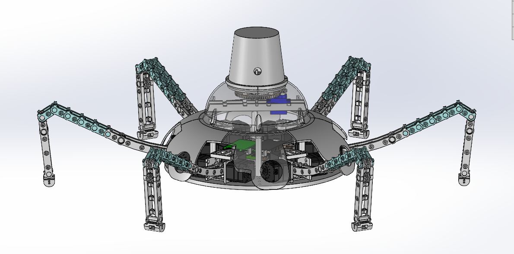

自主プロ ガーディアン ワイヤ駆動(多関節)多脚ロボット
==

## 概要
未完成

『ゼルダの伝説 Breath of the Wild』の「ガーディアン」を模倣したロボット

"ぐらでぃあん"ではない(typo)
## ディレクトリ構造
(まだ整理途中)
* 全体アセンブリは<code>gen2_jisyupro_guardian.sdasm</code>
* <code>gen1_leg-continum</code>および<code>gen2_leg-continum</code>にそれぞれ試作機, 発表会時の脚アセンブリが入っている
* その他の主なパーツは現在親ディレクトリ内に入っている
